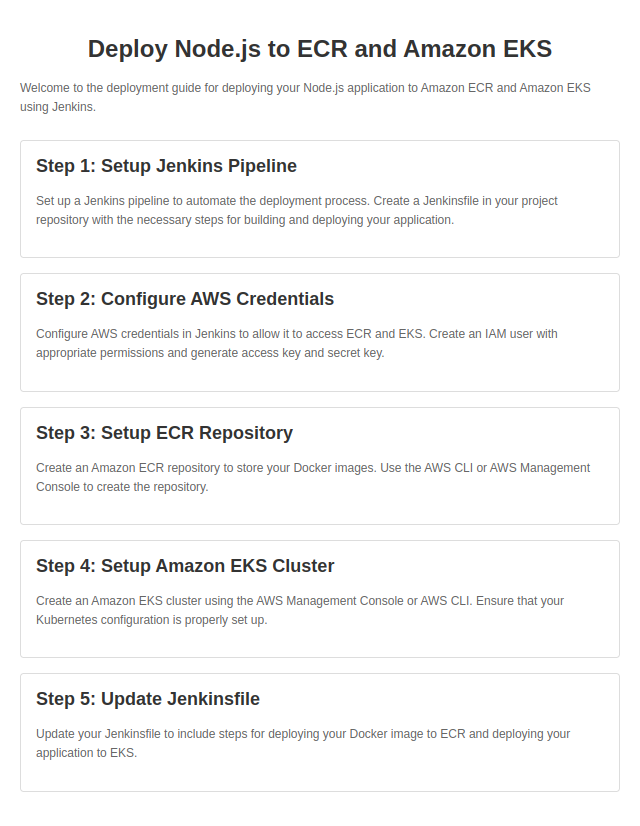

# Deploy Node.js to Amazon ECR and EKS

Welcome to the deployment guide for your Node.js application to Amazon ECR and Amazon EKS using Jenkins.

## Setup Overview

1. **Jenkins Pipeline**: Create a `Jenkinsfile` with build and deploy steps.
2. **AWS Credentials**: Configure IAM user with access keys in Jenkins.
3. **ECR Repository**: Create a repository to store Docker images.
4. **Amazon EKS Cluster**: Set up a cluster for Kubernetes.

## Preview
### Example node.js app index.html page:

## Quick Steps

1. **Jenkins Pipeline**: Set up a pipeline with build and deploy stages.
2. **AWS Credentials**: Configure IAM user credentials in Jenkins.
3. **ECR Repository**: Create a repository via AWS CLI or Console.
4. **Amazon EKS Cluster**: Create a cluster using AWS Console or CLI.
5. **Update Jenkinsfile**: Incorporate steps for ECR and EKS deployment.

Get your Node.js app on ECR and EKS hassle-free! 🚀